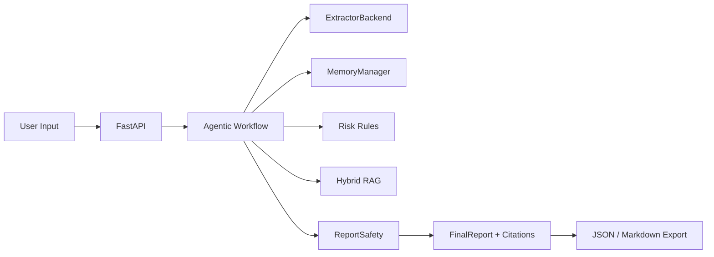

# Product Final Design

## Product Name
TCM-Assistant

## Product Positioning
A structured inquiry assistant for traditional Chinese medicine intake workflows. It organizes symptoms, missing fields, risk signals, and safety reminders. It does not diagnose or prescribe.

## Final System Shape

## Modules
FastAPI owns session APIs, storage-backed replay, RAG/search endpoints, report export, eval endpoints, and OpenAPI. The graph owns turn flow. ExtractorBackend owns structured turn extraction only. Risk rules remain deterministic. RAG supplies cited context. ReportSafety enforces non-diagnosis and non-prescription boundaries.

## Layered Memory
L1 is current turn extraction. L2 is authoritative structured facts. L3 is session summary. L4 is advisory experience memory from synthetic eval failures and cannot override L2.

## Tool Registry
Internal tools remain permissioned and audited. RAG, report safety, export, and eval tools are bounded to local deterministic behavior unless explicitly enabled.

## RAG Design
P10M2 standardizes curated chunks and uses BM25 plus lightweight dense fallback, weighted fusion, citations, and guard checks.

## Safety Boundary
No diagnosis, no prescription, no clinician replacement, offline-care prompts for red flags, and no raw secret logging.

## Data Storage
Default local storage is SQLite for sessions and JSON/JSONL artifacts for eval, RAG, export, and validation outputs.

## Evaluation Metrics
Core gates include RAG recall, citation coverage, faithfulness, redteam violations, prompt/RAG injection success, high-risk false negatives, secret log leakage, API smoke, and regression checks.

## Roadmap
P10M2 finalizes the main system. The next stage may add `local_lora` as an ExtractorBackend only, then compare fake/fallback/local_lora extraction quality under the same safety and eval gates.

## Non-Goals
No diagnosis engine, no prescription engine, no vector database mandate, no real LLM key by default, no model training artifacts in Git, and no Device2 LoRA weights in the main branch.

