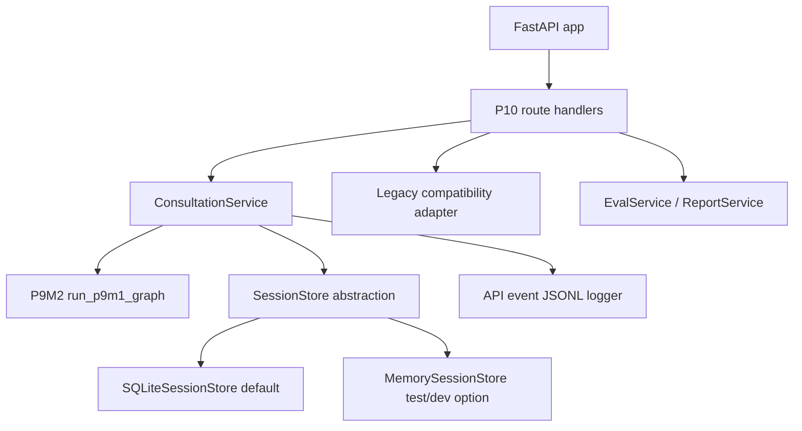

# P10M1 FastAPI Session API + SQLite Service Layer

## 1. Stage Goal

P10M1 exposes the P9M2 multiturn consultation runtime through a FastAPI session API backed by the existing SessionStore abstraction. The stage keeps the legacy P1/P3/P7 API contracts stable while adding P10 endpoints for session state, replay, eval, OpenAPI export, and API-level observability.

This stage does not add diagnosis, prescription, real LLM defaults, PostgreSQL, authentication, MCP hosting, or device-2 LoRA training.

## 2. Modified Files

API surface:
- `app/api/main.py`
- `app/api/deps.py`
- `app/api/errors.py`
- `app/api/models.py`
- `app/api/routes/sessions.py`
- `app/api/routes/turns.py`
- `app/api/routes/eval.py`
- `app/api/routes/replay.py`
- `app/api/schemas/__init__.py`
- `app/api/schemas/request.py`
- `app/api/schemas/response.py`

Service and store layer:
- `app/services/consultation_service.py`
- `app/services/eval_service.py`
- `app/services/report_service.py`
- `app/session/memory_store.py`
- `app/session/sqlite_store.py`

Config, scripts, and tests:
- `.env.example`
- `requirements.txt`
- `scripts/run_p10_api.py`
- `scripts/smoke_p10_api.py`
- `scripts/export_openapi.py`
- `scripts/verify_p10_api.py`
- `tests/p10_api_helpers.py`
- `tests/test_p10_api_*.py`

Artifacts:
- `artifacts/p10/api_events.jsonl`
- `artifacts/p10/api_smoke_result.json`
- `artifacts/p10/api_validation.json`
- `artifacts/p10/api_eval_metrics.json`
- `artifacts/p10/openapi.json`

## 3. API Architecture



The route layer validates request/response contracts. The service layer owns session persistence, graph invocation, replay, report retrieval, and API event emission.

## 4. Service Layer Design

`ConsultationService` centralizes the P10 runtime:
- creates SessionStore-backed sessions with metadata and backend settings
- runs P9M2 graph turns with fake/offline defaults
- mirrors state back to legacy P1/P7 persistence for compatibility
- returns structured state, turn history, reports, and replay output
- writes redacted API events to JSONL
- reports extended health for graph availability, store backend, and configured paths

`EvalService` wraps the existing P9M2 multiturn metrics path and writes P10 eval output. `ReportService` keeps report access narrow and explicit.

## 5. Endpoints

Legacy-compatible endpoints:
- `GET /health`
- `POST /sessions`
- `POST /sessions/{session_id}/turn`
- `GET /sessions/{session_id}/report`

P10 endpoints:
- `GET /health?extended=true`
- `POST /turn`
- `GET /sessions/{session_id}/state`
- `GET /sessions/{session_id}/turns`
- `POST /sessions/{session_id}/replay`
- `POST /eval/p9m2-multiturn`

Example:

```bash
curl -X POST http://127.0.0.1:8000/sessions \
  -H "Content-Type: application/json" \
  -d "{\"metadata\":{\"client\":\"p10-smoke\"},\"backend\":\"fake\"}"

curl -X POST http://127.0.0.1:8000/sessions/<session_id>/turn \
  -H "Content-Type: application/json" \
  -d "{\"text\":\"I feel tired and have poor sleep.\",\"extractor_backend\":\"fake\"}"
```

## 6. Schema Summary

P10 request schemas add optional `metadata`, `backend`, `store_backend`, `extractor_backend`, and debug flags. P10 response schemas add `trace_id`, `turn_id`, `risk_status`, `missing_core_fields`, `state_summary`, `retrieved_evidence_count`, `fallback_used`, `safety_rewrite_used`, and replay/eval payloads.

The default `/health` response remains the frozen P1 body. Extended health is only returned with `extended=true`, avoiding drift in existing snapshot tests.

## 7. SessionStore / SQLite Reuse

P10 reuses the P9M2 `SessionStore` interface instead of creating a parallel persistence model. SQLite is the default backend via `SESSION_STORE_BACKEND=sqlite` and `SESSION_SQLITE_PATH=artifacts/p10/p10_sessions.sqlite3`. Memory storage remains available for tests and short-lived local runs.

Both SQLite and memory stores now expose `get_session_record()` so API endpoints can return session metadata without bypassing the store boundary.

## 8. API Event Schema

API events are JSONL records written to `API_LOG_PATH`, defaulting to `artifacts/p10/api_events.jsonl`. Each event includes:
- `event_type`
- `session_id`
- `trace_id`
- `turn_id`
- `endpoint`
- `status`
- `duration_ms`
- `backend`
- `store_backend`
- `error_code`
- `timestamp`

Events intentionally avoid raw user input, secrets, environment dumps, and prompt payloads.

## 9. Safety Boundary

P10 keeps the TCM assistant as a consultation-support workflow, not a diagnosis or prescription system. Defaults stay offline/fake, real LLM is disabled unless explicitly configured, and real-LLM requests without configuration return `REAL_LLM_NOT_CONFIGURED`.

The API preserves P9M2 safety behavior for diagnosis, prescription, prompt injection, and unsafe instruction requests. Risk status remains rule-owned and cannot be overwritten by retrieved evidence.

## 10. API Smoke Result

`python scripts\smoke_p10_api.py` passed and wrote `artifacts/p10/api_smoke_result.json`.

Covered:
- extended health
- session creation
- multiturn API flow
- state retrieval
- report retrieval
- replay
- OpenAPI availability
- API event logging

## 11. Pytest Result

Full suite:

```text
426 passed, 2 warnings, 74 subtests passed in 365.30s
```

Focused P10 API tests passed, and legacy P1/P3/P7 API compatibility tests passed after the P10 response-shaping changes.

## 12. P9M2 Regression

`scripts/verify_p10_api.py` includes P9M2 regression checks and passed. The validation artifact is `artifacts/p10/api_validation.json`.

The P9M2 baseline commit before P10 work is `504b207 p9: add multiturn observability backbone`.

## 13. Secret / Log Safety Scan

`python scripts\secret_scan.py --json --output artifacts\secret_scan_result.json` passed with:
- status: `ok`
- finding_count: `0`

The API event log was checked for unsafe raw input and secret leakage as part of P10 validation.

## 14. Known Limitations

- No authentication or authorization layer is included yet.
- SQLite is suitable for device-local validation, not multi-node production deployment.
- Real LLM integration remains opt-in and is not exercised by default.
- Replay is deterministic for stored API/session data, but external model calls remain outside the default path.
- P10 does not change the frozen P7 branch or device-2 training workflow.

## 15. Next-Stage Suggestions

- Add authn/authz and request rate limits before any network exposure.
- Add deployment profiles for local device service vs. internal lab service.
- Add API contract snapshots for OpenAPI and P10 response examples.
- Add optional real-LLM live smoke behind explicit environment gating.
- Add dashboard or CLI tooling for reading API event JSONL and replay artifacts.
