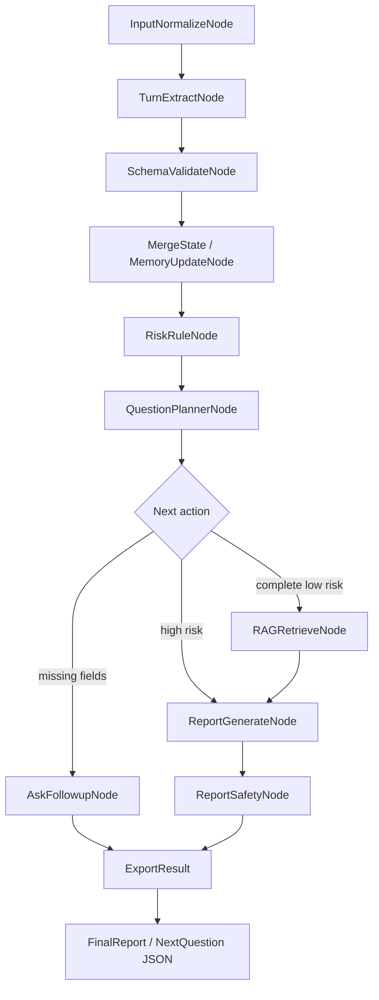

# P9M1 Real Path Validation

## 1. 阶段目标

设备1 P9M1 目标是落地主系统 P0.2 最小工程闭环：用户自然语言输入经过结构化抽取、Pydantic 校验、RunState 合并、规则风险兜底、追问或 BM25 检索、报告生成、安全检查，最终输出 JSON 可序列化结果。系统边界保持为问诊辅助、风险提示、不替代医生、不诊断、不开方。

## 2. 本次新增/修改文件

核心实现：
- `app/schemas/turn_output.py`
- `app/schemas/run_state.py`
- `app/schemas/risk.py`
- `app/schemas/final_report.py`
- `app/schemas/evidence.py`
- `app/schemas/report_schemas.py`
- `app/extractors/base.py`
- `app/extractors/fake_extractor.py`
- `app/extractors/simple_rules.py`
- `app/extractors/rule_fallback_extractor.py`
- `app/extractors/real_llm_extractor.py`
- `app/extractors/router.py`
- `app/extractors/__init__.py`
- `app/rules/risk_rules.py`
- `app/rules/rule_types.py`
- `app/rules/negation.py`
- `app/rules/rule_ids.py`
- `app/rag/bm25_retriever.py`
- `app/rag/knowledge_loader.py`
- `app/rag/evidence.py`
- `app/graph/state.py`
- `app/graph/nodes.py`
- `app/graph/edges.py`
- `app/graph/builder.py`
- `app/graph/runner.py`
- `app/safety/report_safety.py`
- `app/api/report_validator.py`

配置、数据、脚本、测试：
- `.env.example`
- `requirements.txt`
- `pytest.ini`
- `knowledge/knowledge_base.txt`
- `scripts/run_p9m1_demo.py`
- `scripts/eval_p9m1_graph.py`
- `data/eval/p9m1_cases.jsonl`
- `artifacts/p9m1/predictions.jsonl`
- `artifacts/p9m1/failures.jsonl`
- `artifacts/p9m1/metrics.json`
- `tests/conftest.py`
- `tests/test_p9m1_graph.py`
- `tests/test_extractor_router.py`
- `tests/test_risk_rules.py`
- `tests/test_bm25_retriever.py`
- `tests/test_report_safety.py`

## 3. LangGraph 主流程图



## 4. ExtractorBackend 支持情况

| Backend | 状态 | 说明 |
|---|---:|---|
| `fake` | 已实现 | 规则化稳定抽取，用于 demo/test/eval |
| `rule_fallback` | 已实现 | 纯关键词/正则抽取，不调用 LLM |
| `real_llm` | 已实现入口 | `ENABLE_REAL_LLM=false` 或缺 API 配置时返回可追踪 fallback metadata，不影响测试 |
| `local_base` | 预留 | 抛出 `reserved for device2 integration` |
| `local_lora` | 预留 | 抛出 `reserved for device2 integration` |

## 5. 风险规则列表与 rule_id

| rule_id | 风险信号 | 说明 |
|---|---|---|
| `P0_RISK_HIGH_FEVER` | 持续高热/高烧不退/39 度相关 | 明确高热才触发；普通发热不直接触发 |
| `P0_RISK_CHEST_PAIN` | 胸痛/胸口痛/心口痛 | 支持“不胸痛”“没有胸痛”否定 |
| `P0_RISK_DYSPNEA` | 呼吸困难/喘不上气 | 支持“没有呼吸困难”否定 |
| `P0_RISK_GI_BLEEDING` | 便血/呕血/黑便 | 支持“未见便血”“没有呕血”否定 |
| `P0_RISK_CONSCIOUSNESS` | 意识模糊/意识异常 | 高风险，进入安全报告 |
| `P0_RISK_SEVERE_ABDOMINAL_PAIN` | 剧烈腹痛/突发剧烈腹痛 | 高风险，进入安全报告 |

每个风险事件输出包含 `rule_id`、`risk_level`、`triage_level`、`reason`、`evidence_text`、`negated`。

## 6. BM25 检索样例

输入：

```text
胃胀一周，没有其他症状，睡眠一般，食欲一般，大便正常，小便正常，没有胸痛，没有呼吸困难，没有便血
```

检索结果摘要：
- `kb-2-ba95342ed858`: 常见消化不适问诊要点
- `kb-4-3fa31b0ca6a0`: 高风险信号提示

RAG evidence 只进入 `FinalReport.impression/advice/metadata`，不写入 `chief_complaint`、`duration`、`risk_flags_status`、`triggered_rule_ids`。

## 7. Demo 输入输出样例

命令：

```bash
python scripts/run_p9m1_demo.py --input "最近胃胀，饭后明显，差不多一周，没有发热，也不胸痛"
```

实际摘要：
- `risk_status`: `none`
- `risk_reasons`: 记录了 `P0_RISK_CHEST_PAIN` 与 `P0_RISK_HIGH_FEVER` 的明确否定事件
- `missing_core_fields`: `accompanying_symptoms`, `sleep`, `stool`, `urination`
- `next_question`: `是否还有伴随症状？如果没有，也可以直接说没有。`
- `final_report`: `null`，因为当前信息仍需追问

内置 demo cases：
1. 胃胀一周，没有发热，不胸痛
2. 胸痛伴呼吸困难
3. 便血两天
4. 头痛三天，未见发热
5. 睡眠差一个月，食欲一般

## 8. Eval metrics

命令：

```bash
python scripts/eval_p9m1_graph.py
```

实际结果：

| metric | value |
|---|---:|
| total_cases | 30 |
| final_schema_pass_rate | 1.0 |
| raw_llm_json_valid_rate | null (`fake` backend) |
| fallback_used_rate | 0.0 |
| high_risk_false_negative | 0 |
| high_risk_false_positive | 0 |
| negation_accuracy | 1.0 |
| repeated_question_rate | 0.0 |
| state_loss_rate | 0.0 |
| rag_recall_at_3 | 1.0 |
| report_safety_violation | 0 |
| failed_cases | 0 |

## 9. Failures / badcases 摘要

`artifacts/p9m1/failures.jsonl` 为空。当前 30 条 P9M1 eval case 均通过。

## 10. 安全边界说明

P9M1 输出保持以下边界：
- 不诊断，不输出“诊断为/确诊”等诊断化表达。
- 不开方，不输出“处方/开方/建议服用某某药方”等处方化表达。
- 风险状态由规则引擎决定，LLM/RAG 不允许覆盖。
- RAG evidence 只增强报告语义，不改写 RunState 核心字段。
- FinalReport 包含 `safety_disclaimer`，并通过 `ReportSafetyNode` 后处理。

## 11. 未完成事项

- `real_llm` 未在本地使用真实 API key 联调；当前入口已实现缺配置安全跳过和可追踪 metadata。
- `local_base` / `local_lora` 仅作为设备2集成预留入口，未训练、未调用模型权重。
- 当前 BM25 知识库是最小可用文本，后续可接入已治理的知识切片。

## 12. 下一阶段建议

1. 用真实 OpenAI-compatible provider 跑一轮 `EXTRACTOR_BACKEND=real_llm ENABLE_REAL_LLM=true` 的小样本验证，重点看 JSON 解析率和 schema pass rate。
2. 把 P9M1 eval case 扩展为多轮状态保持集，覆盖“先否定后新增风险”“先高风险后普通描述”的粘性风险状态。
3. 将 `knowledge/knowledge_base.txt` 替换或合并到 P6/P8 已治理知识流水线，继续保持 RAG 只读核心状态的边界。
4. 设备2 Local-LoRA 接入时只替换 `ExtractorBackend`，不要移动风险规则、报告安全和 RAG 边界逻辑。

## 验收命令结果

```bash
python scripts/run_p9m1_demo.py --input "最近胃胀，饭后明显，差不多一周，没有发热，也不胸痛"
python scripts/eval_p9m1_graph.py
pytest -q
```

实际：
- Demo 命令成功输出 `session_id`、`extracted_turn_output`、`run_state`、`risk_status`、`risk_reasons`、`missing_core_fields`、`next_question`、`trace`。
- Eval 命令成功生成 `artifacts/p9m1/predictions.jsonl`、`artifacts/p9m1/failures.jsonl`、`artifacts/p9m1/metrics.json`。
- `pytest -q`: `397 passed, 2 warnings, 74 subtests passed in 305.81s`。

未执行 `pip install -r requirements.txt`，以避免在当前工作环境中重新安装/变更依赖；`requirements.txt` 已补充 P9M1 需要的依赖项。
