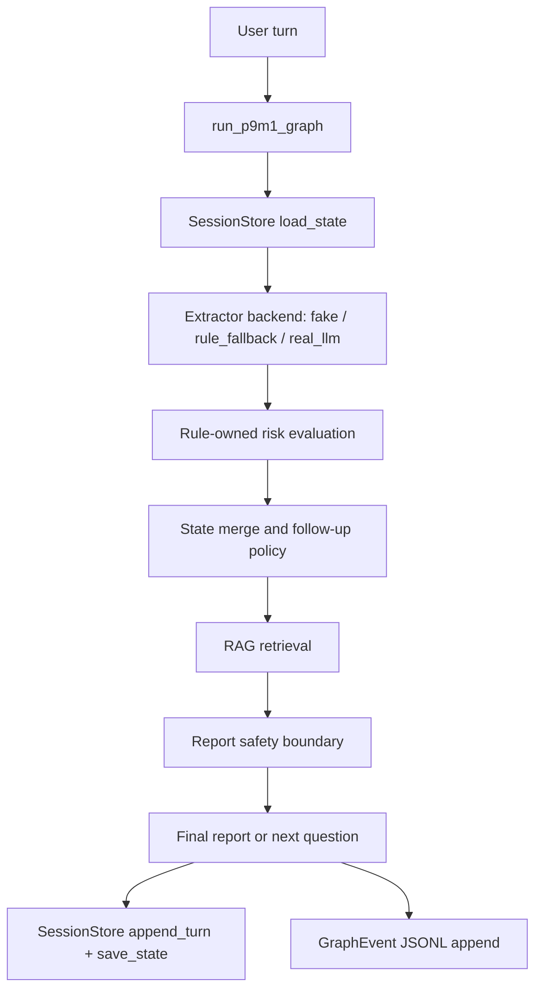

# P9M2 Multiturn State Retention + Real LLM Smoke + Observability Backbone

## 1. Stage Goal

P9M2 upgrades the P9M1 single-turn real-path baseline into a reproducible multiturn consultation path. The stage proves that core fields persist across turns, follow-up questions are not repeated, rule-owned risk status is sticky, RAG cannot overwrite core clinical state, and safety boundaries remain active for diagnosis/prescription/prompt-injection requests.

This stage intentionally does not implement a full FastAPI service, MCP server, PostgreSQL backend, or device-2 LoRA training flow.

## 2. Modified Files

Core graph/runtime changes:
- `app/graph/state.py`
- `app/graph/runner.py`
- `app/graph/nodes.py`
- `app/extractors/simple_rules.py`

Session/checkpoint store:
- `app/session/__init__.py`
- `app/session/models.py`
- `app/session/store.py`
- `app/session/memory_store.py`
- `app/session/sqlite_store.py`
- `app/session/replay.py`

Observability:
- `app/observability/events.py`
- `app/observability/json_logger.py`
- Existing `app/observability/trace.py` is reused as part of the observability package.

Internal tool registry:
- `app/tools/base.py`
- `app/tools/builtin.py`
- `app/tools/registry.py`

Eval, demo, and smoke scripts:
- `scripts/validate_p9m2_real_llm.py`
- `scripts/eval_p9m2_multiturn.py`
- `scripts/run_p9m2_multiturn_demo.py`
- `scripts/replay_p9m2_session.py`

Datasets and tests:
- `data/eval/p9m2_real_llm_smoke_cases.jsonl`
- `data/eval/p9m2_multiturn_cases.jsonl`
- `tests/test_p9m2_json_logs.py`
- `tests/test_p9m2_multiturn_state.py`
- `tests/test_p9m2_real_llm_skip.py`
- `tests/test_p9m2_replay.py`
- `tests/test_p9m2_session_store.py`
- `tests/test_p9m2_tool_registry.py`

Artifacts:
- `artifacts/p9m2/graph_events.jsonl`
- `artifacts/p9m2/multiturn_predictions.jsonl`
- `artifacts/p9m2/multiturn_failures.jsonl`
- `artifacts/p9m2/multiturn_metrics.json`
- `artifacts/p9m2/real_llm_smoke_metrics.json`
- `artifacts/p9m2/real_llm_predictions.jsonl`
- `artifacts/p9m2/real_llm_failures.jsonl`
- `artifacts/p9m2/p9m2_sessions.sqlite3`

## 3. Graph / Session Flow



The runner now accepts optional `session_id`, `trace_id`, `turn_id`, `session_store`, and `graph_events_path`. Each turn writes a replayable session state and a redacted graph event.

## 4. SessionStore Design

`SessionStore` is a small interface with Memory and SQLite implementations:
- `MemorySessionStore` is for fast unit tests.
- `SQLiteSessionStore` is for local demos and P1 service preparation.
- SQLite uses the standard library `sqlite3`; no ORM is introduced.
- Stored records are JSON serializable and can be exported/replayed through `app/session/replay.py`.

Supported operations include session creation, turn append, state save/load, turn listing, event save, session export, and replay.

## 5. JSON Event Schema

`GraphEvent` includes:
- `trace_id`, `session_id`, `turn_id`
- `node`, `graph_runtime`, `extractor_mode`
- `raw_llm_json_valid`, `final_schema_pass`, `fallback_used`
- `risk_rule_ids`, `retrieved_evidence_count`, `safety_rewrite_used`
- `latency_ms`, `timestamp`
- `input_length`, `redacted_input_hash`
- sanitized `metadata`

Long-term graph logs do not store full user input by default. They store only length and a short hash. Event sanitization redacts key-like values and forbidden key names such as API keys and authorization headers.

## 6. Tool Registry Design

`app/tools/registry.py` now keeps the previous P7 registry behavior and adds a minimal P9M2 internal `ToolRegistry`. Built-in tool specs cover:
- `risk_check_tool`
- `rag_search_tool`
- `report_safety_tool`
- `export_report_tool`
- `eval_case_tool`

Each tool has a name, description, input schema, output schema, safety level, and callable handler. This is an internal registry skeleton, not an MCP server.

## 7. Real LLM Smoke

Command used for deterministic local acceptance:

```powershell
$env:ENABLE_REAL_LLM='true'; $env:EXTRACTOR_BACKEND='real_llm'; Remove-Item Env:P9M2_ALLOW_REAL_LLM_LIVE -ErrorAction SilentlyContinue; python scripts\validate_p9m2_real_llm.py --limit 20
```

Result:
- `status`: `skipped`
- `skipped`: `true`
- `skip_reason`: `P9M2_ALLOW_REAL_LLM_LIVE=false`
- `token_usage_available`: `false`

The validator also clean-skips when `ENABLE_REAL_LLM=false` or when required OpenAI configuration is missing. Live provider calls require both usable OpenAI configuration and `P9M2_ALLOW_REAL_LLM_LIVE=true`, preventing accidental network calls or secret leakage during local/CI acceptance.

## 8. Multiturn Metrics

Command:

```powershell
python scripts\eval_p9m2_multiturn.py
```

| Metric | Value |
| --- | ---: |
| dialogue_count | 50 |
| total_turns | 168 |
| final_schema_pass_rate | 1.0 |
| state_loss_rate | 0.0 |
| repeated_question_rate | 0.0 |
| core_field_completion_rate | 1.0 |
| high_risk_false_negative | 0 |
| high_risk_false_positive | 0 |
| high_risk_sticky_pass_rate | 1.0 |
| negation_retention_rate | 1.0 |
| rag_core_overwrite_violation | 0 |
| report_safety_violation | 0 |
| fallback_used_rate | 0.0 |
| avg_turns_to_report | 2.76 |
| failures_count | 0 |

All P9M2 target thresholds passed.

## 9. Failures Summary

`artifacts/p9m2/multiturn_failures.jsonl` is empty.

`artifacts/p9m2/real_llm_failures.jsonl` is empty because the real LLM smoke was intentionally skipped without executing live provider calls.

## 10. Safety Boundary Verification

Validated boundaries:
- High-risk status remains rule-owned and sticky.
- Negated high-risk terms are retained across later turns.
- RAG evidence does not overwrite `chief_complaint`, `duration`, `risk_status`, or risk rule IDs.
- Diagnosis, prescription, and prompt-injection requests are blocked by report safety logic.
- JSONL graph events use `input_length` and `redacted_input_hash` instead of full user input.
- P9M2 artifact secret scan returned `NO_SECRET_MARKERS_FOUND` for `OPENAI_API_KEY`, `Authorization`, and `sk-*` patterns.

Validation commands:

```powershell
pytest -q
```

Result: `410 passed, 2 warnings, 74 subtests passed in 329.85s`.

Focused P9M2 tests:

```powershell
pytest -q tests\test_p9m2_multiturn_state.py tests\test_p9m2_real_llm_skip.py tests\test_p9m2_session_store.py tests\test_p9m2_json_logs.py tests\test_p9m2_tool_registry.py tests\test_p9m2_replay.py
```

Result: `12 passed`.

Demo command:

```powershell
python scripts\run_p9m2_multiturn_demo.py --backend fake
```

Demo wrote:
- `artifacts/p9m2/graph_events.jsonl`
- `artifacts/p9m2/p9m2_sessions.sqlite3`

Replay CLI:

```powershell
python scripts\replay_p9m2_session.py --help
```

Result: CLI help is available with `--session-id` and `--db`.

## 11. Unfinished / Known Limits

- Real provider smoke was not live-tested in this environment. It clean-skips unless `P9M2_ALLOW_REAL_LLM_LIVE=true` is explicitly set.
- SQLite session storage is a local demo/P1-prep implementation, not a production multi-user service.
- Tool Registry is internal-only and intentionally does not expose MCP.
- SessionStore persists replayable turn content for local replay. Long-term graph logs remain redacted by default.
- Existing unrelated P6/P8 dirty artifacts were left untouched.

## 12. Next Stage Suggestions

- P1 service layer: expose session create/turn/replay endpoints through FastAPI while preserving P9M2 store interfaces.
- Add a live real-LLM smoke job in a controlled secret-enabled environment with `P9M2_ALLOW_REAL_LLM_LIVE=true`.
- Add event aggregation over `graph_events.jsonl` for fallback, latency, risk-hit, and safety-rewrite dashboards.
- Extend SQLite session migrations only if the P1 API requires schema evolution.
- Keep risk status rule-owned when introducing any future LLM or RAG improvements.
